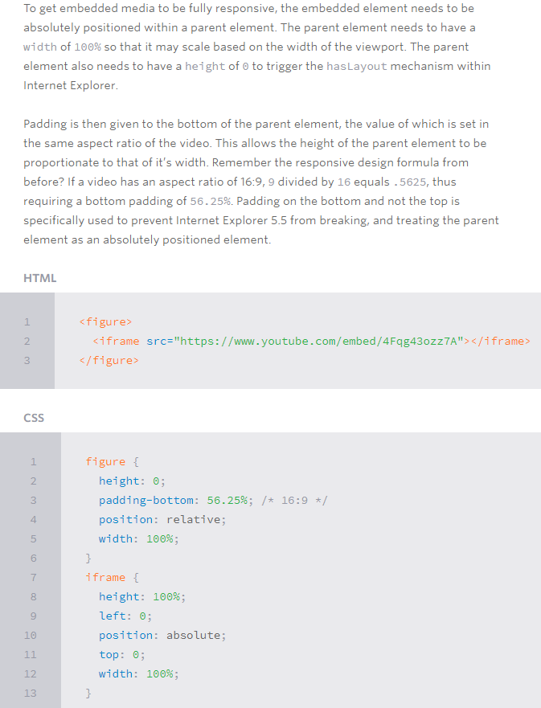

# Read: 01 - SMACSS and Responsive Web Design

## Shay Howe’s intro to RWD

- Responsive Web Design (RWD)
  - The practice of building a website suitable to work on every device and every screen size, no matter how large or small, mobile or desktop. 
  - Focused around providing an intuitive and gratifying experience for everyone. 
- Responsive vs Adaptive vs Mobile
  - **Responsive design websites** continually and fluidly change based on different factors, while **adaptive websites** are built to a group of present factors
    - Combination of two is ideal, providing the perfect formula for functional websites. 
  - **Mobile** generally means to build a separate website commonly on a new domain solely for mobile users
    - Not the best sought out solution
  - Responsive web design is the more sought out solution 
- Responsive web design is broken into three main components
  - Flexible layouts
    - The practice of building the layout of a website with a flexible grid, capable of dynamically resizing to any width
    - Uses percentages or ems, **not fixed measurement units**
      - Viewport height and width continually change from device to device
    - Result is the relative width of the target element
      - ***target ÷ context = result***
  - Media queries
    - provide the ability to specify different styles for individual browser and device circumstances
    - Couple of different ways to use media queries 
      - Using the **@media** rule inside of an existing style sheet
      - Importing a new style sheet using the @import rule
      - By linking to a separate stylesheet from within the HTML document

```
<!-- Separate CSS File in HTML -->
<link href="styles.css" rel="stylesheet" media="all and (max-width: 1024px)">

/* @media Rule in CSS*/
@media all and (max-width: 1024px) {...}

```
    - Each media query may include a media type followed by one or more expressions
      - Common media types include all, screen, print, tv and braille
    - Using the and logical operator within a media query allows an extra condition to be added, making sure that a browser or devices does both a, b, c, and so forth
    - One of the most common media features revolves around determining a **height or width** for a device or browser viewport. 
    - The **orientation media feature** determines if a device is in the landscape or portrait orientation
    - The **aspect-ratio and device-aspect-ratio** features specify the width/height pixel ratio of the targeted rendering area or output device.
      - Indicated by two positive numbers, first identifies width and second is height
    - The resolution media feature specifies the resolution of the output device in pixel density, also known as dots per inch or DPI.
  - Flexible media



- Mobile first
  - Includes using styles targeted at smaller viewports as the default styles for a website, then use media queries to add styles as the viewport grows
  - A user on a mobile device, commonly using a smaller viewport, shouldn’t have to load the styles for a desktop computer only to have them over written with mobile styles later
  - Advocates designing with the constraints of a mobile user in mind
- Viewport meta tag
  - the **height or width** values will define the height or width of the viewport respectively
  - To control how a website is scaled on a mobile device, and how users can continue to **scale** a website
  - When more control is needed, specifically over the resolution of a device, the **target-densitydpi** value may be used

## All about Floats

- Float is a CSS positioning property and has four valid values:
  - Left and Right 
    - Float elements those directions respectively
  - None
    - Ensures the element will not float
  - Inherit
    - Will assume the float value from that elements parent element
- When using floats other elements will reflow to accommodate
- Float’s sister property is clear and has its own values
  - clear property set on it will not move up adjacent to the float like the float desires, but will move itself down past the float
  - Both
    - Clears floats coming from either direction
  - Left and Right
    - Used to only clear the float from one direction respectively
  - None
    - The default
- Techniques for clearing floats
  - clear: both;
  - The empty div method
    - Not the most sought out method but gets the job done
  - The overflow method
    - Relies on setting the overflow CSS property on a parent element
- Problem with floats
  - **Pushdown** is a symptom of an element inside a floated item being wider than the float itself
  - **Double Margin Bug**, if you apply a margin in the same direction as the float, it will double the margin
  - **3px Jog**, when text that is up next to a floated element is mysteriously kicked away by 3px like a weird forcefield around the float
  - **Bottom Margin Bug**, if a floated parent has floated children inside it, bottom margin on those children is ignored by the parent

[Back to README](README.md)