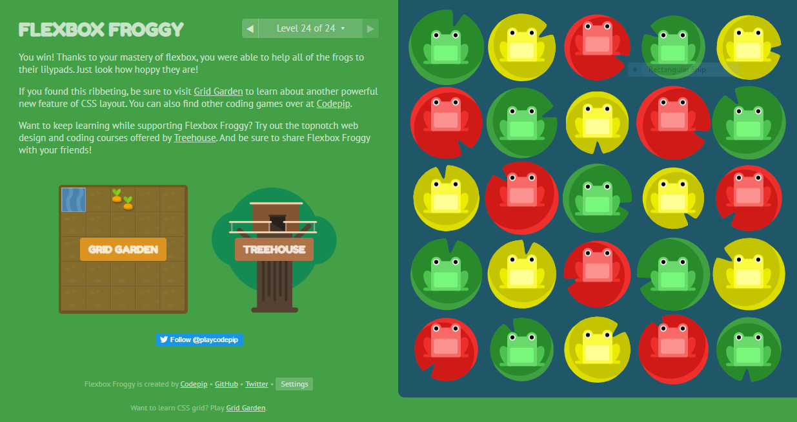

# Read: 03 - Flexbox and Templating

## Templating with Mustache

- Mustache is a logic-less template syntax.
  - It is referred to as ‘logic-less’ because there are no if statements, else clauses, or for loops. Instead, there are only tags.
  - Mustache.js is an implementation of the mustache template system in JavScript.

## A Guide to Flexbox

- Saved the website in bookmarks

## Flexbox Froggy

