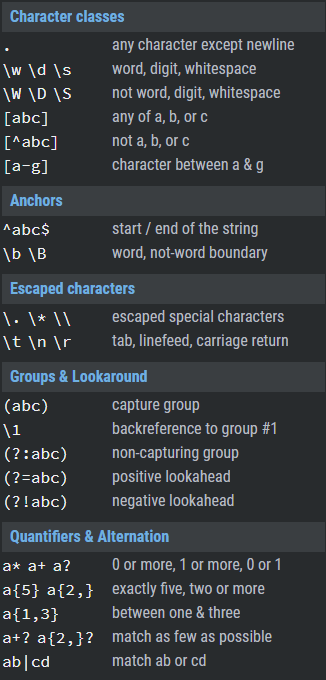

# Read: 04 - Responsive Web Design and Regular Expressions

## CSS Grid Garden

- Compeleted the grid tutorial


## RegExr - Pay particular attention to the cheatsheet



## Regex Tutorial

- **Regular expressions (regex or regexp)** are extremely useful in extracting information from any text by searching for one or more matches of a specific search pattern.

## Responsive design with CSS Grid

- Grid gives us control over how wide or narrow each of the ‘grid cells’ get.
  - ```grid-template-columns: repeat(auto-fill, minmax(250px, 1fr));```
    - ```auto-fill``` which will create a grid with as many tracks as will fit into the container
    - ```minmax(250px, 1fr)```, minmax function will create track widths that can be a minimum of 250px wide and a maximum of 1fr
    - ```object-fit: cover```, will stop the image from stretching, but it will cause cropping to happen
  - Column and row gap help space out content
