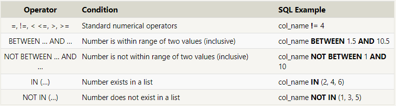

# Read: 08 - SQL

## Complete SQLBolt (Intro, Lessons 1-4, 13-18)

- Structured Query Language (SQL)
  - a language designed to allow both technical and non-technical users to query, manipulate, and transform data from a relational database.
  - Provide safe and scalable storage for millions of websites and mobile applications.
- Relational database
  - Represents a collection of related (two-dimensional) tables.
  - SQL goal is to learn how to answer specific questions about the data
- **SELECT** statements (queries)
  - A query in itself is just a statement  which declares what data we are looking for, where to find it in the database, and optionally, how to transform it before it is returned.
- Table in SQL as a type of an entity (ie. Dogs), and each row in that table as a specific instance of that type (ie. A pug, a beagle, a different colored pug, etc). This means that the columns would then represent the common properties shared by all instances of that entity (ie. Color of fur, length of tail, etc).
- **WHERE** clause
  - Applied to each row of data by checking specific column values to determine whether it should be included in the results or not.
  - More complex clauses can be constructed by joining numerous AND or OR logical keywords

- **DISTINCT** clause
  - Discard rows that have a duplicate column value.
- **GROUP BY** clause
  - Provides a way to sort your results by a given column in ascending or descending order
  - With DISTINCT clause -  to discard duplicates based on specific columns using grouping.
  - Each row is sorted alpha-numerically based on the specified column's value.
  - **LIMIT** will reduce the number of rows to return, and the optional **OFFSET** will specify where to begin counting the number rows from.
- Database schema
  - Describes the structure of each table, and the data types that each column of the table can contain.
- **INSERT** statement
  - Declares which table to write into, the columns of data that we are filling, and one or more rows of data to insert.
  - You can use mathematical and string expressions with the values that you are inserting.
- **UPDATE -  SET - WHERE** statement
  - Update existing data
  - Be careful not to update within the wrong row/column
  - Good practice to write the constraint first ans test in a SELECT query.
- **DELETE - WHERE** statement
  - Delete data from a table in the database
- **CREATE TABLE**
  - When you have new entities and relationships to store in your database, you can create a new database table.

[Back to README](README.md)
