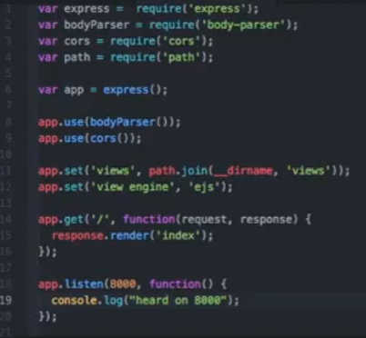
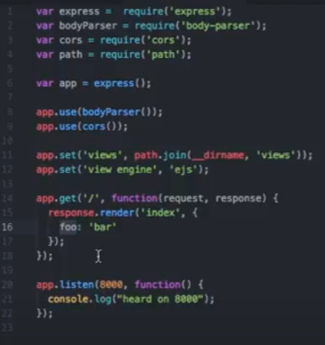
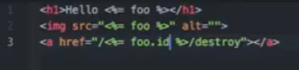
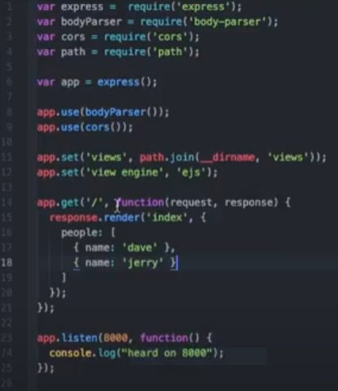
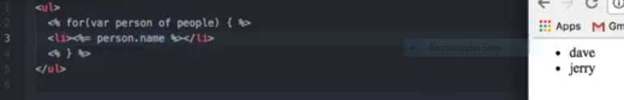
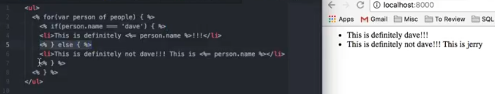

# Read: 11 - EJS

## Watch EJS tutorial from WalkThroughCode on YouTube, Videos 1-5

- Npm init -y
- Npm install --save express body-parser cors ejs
- Setting up
  - 
Injecting values into the views
  - 
  - 
For loops and arrays EJS
  - 
  - 
If/Else Statement with some layout server.js file as before
  - 

[Back to README](README.md)
