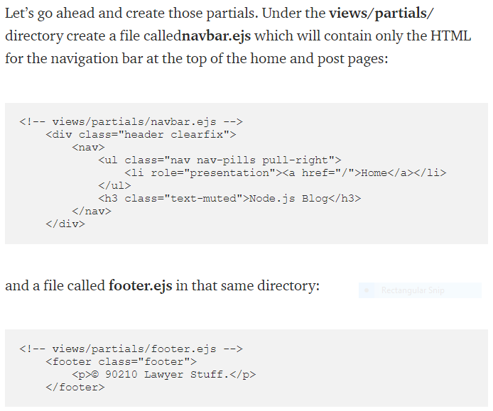
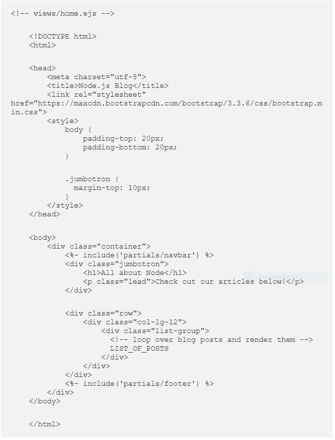
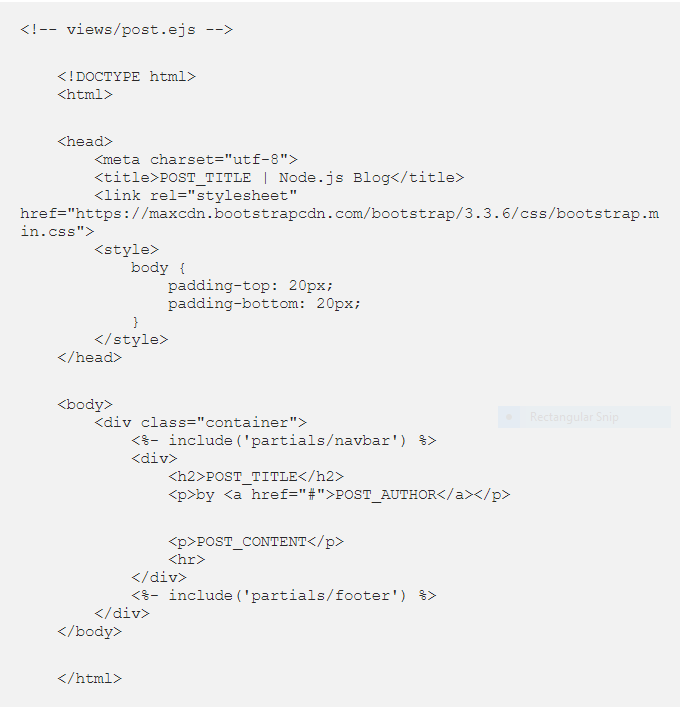

# Read: 12 - Components

## EJS Partials

- Think of partials as functions, they make large websites easier to maintain as you don’t have to go and change a piece of text in every page it appears in.
  - Instead, you define that reusable bundle of code in a file and include it wherever you need it.

- Navbar and footer.ejs

- EJS is surrounded by <%%>

-Views/home.ejs

-Views/post.ejs

[Back to README](README.md)
