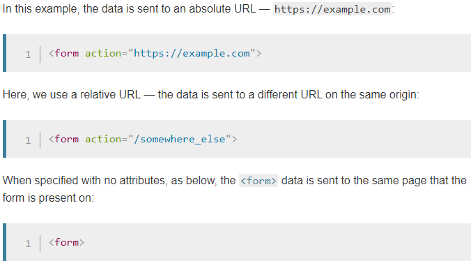
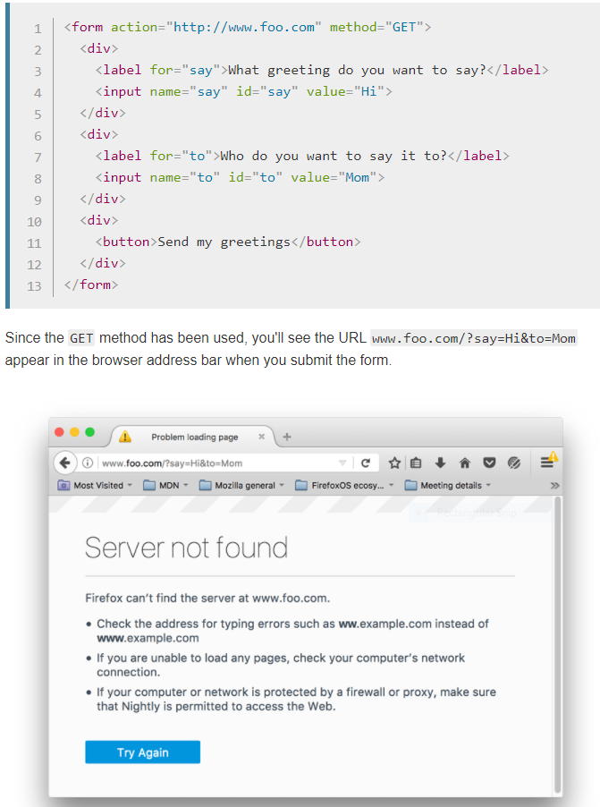
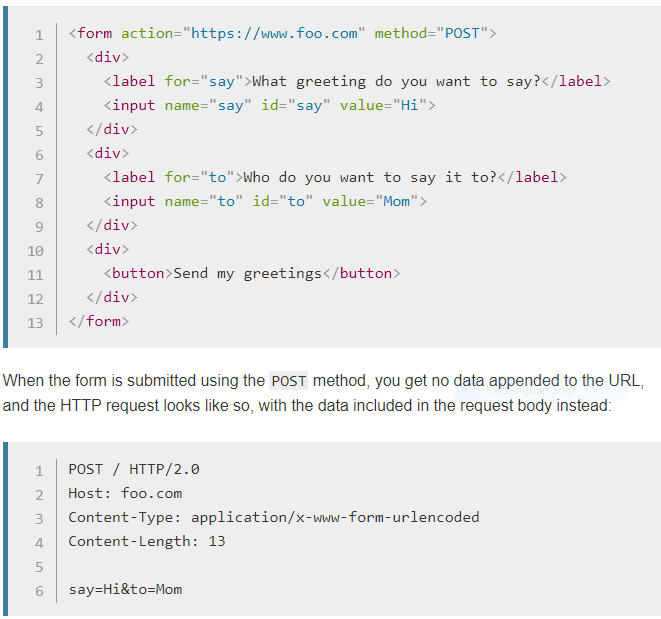

# Read: 13 - Update/Delete

## Sending from Data

- Objective
  - To understand what happens when form data is submitted, including getting a basic idea of how data is processed on the server
- Client sends a request to the server, then the server sends over the response to client.
- ```<form>``` defines how the data will be sent
  - Takes two attributes **action** and **method**
  - Action attribute defines where the data gets sent.

- Form example


- Method attribute defines how data is sent. The two most common ways are **GET** and **POST**
  - The GET method
    - Method is used by the browser to ask the server to send back a given resource.

- Form GET Method


  - The POST method
    - Method is used by the browser to talk to the server when asking for a response that takes into account the data provided in the body of the HTTP request.
    - Form uses this method, data is appended to the **body**

- Form POST Method


- Security Issues
  - **Escape potentially dangerous characters.**
  - **Limit the incoming amount of data to allow only what's necessary.**
  - **Sandbox uploaded files.**
    - Store them on a different server and allow access to the file only through a different subdomain.

[Back to README](README.md)
