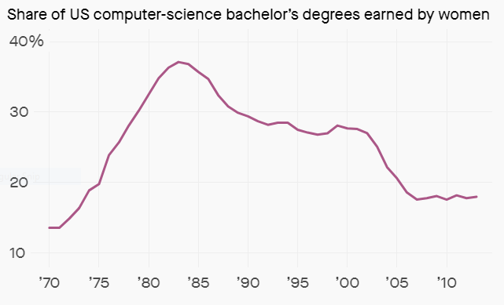
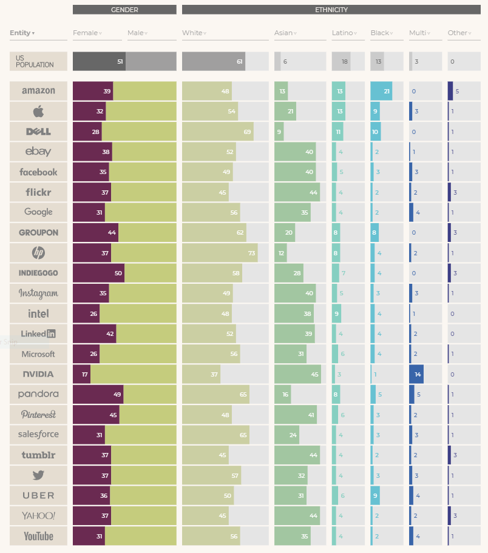

# Read: 15 - Diversity and Inclusion

## Silicon Valley’s gender gap is the result of computer-game marketing 20 years ago

- 70% of the employees at the top tech companies in Silicon Valley, such as Google, Facebook, and Twitter, were male.
- Only 10% of the technical workforce at Twitter is female.
- In 1984, 37% of computer science graduates were women, but those numbers began to drop dramatically in the middle of the decade.

- According to a recent study conducted by Glassdoor, 11 of the 25 best-paying jobs are technology related, with an average earning potential of between $106,000 and $130,000 a year.
- Employment of computer and information-technology occupations will grow by 12% between 2014 and 2024, faster than the average for any other occupation.
- The primary reason for the large difference of men and women in tech is that games were marketed to boys.
  - It’s no coincidence that the console touted to have saved the industry was called a “Game Boy.”
- 40% of male respondents passed the advanced-placement computer-science exam
- By the time students now reach university, 20% of men plan to take on a career in engineering or computing. Among women, that number is just 5.8%.
- It is clear that the advertising narrative around women and technology needs to be more inclusive if the gender gap is going to close.

## Employee breakdown of key technology companies

## Why diversity matters to your tech company

- Diverse teams are smarter and more creative 
  - Diverse groups of people bring to organizations more and different ways of seeing a problem and, thus, faster/better ways of solving it.
  - A fully diverse and inclusive workplace is fundamental to our ability to innovate and deliver business results.
- Diverse companies perform better
  - Female representation in top management leads to an increase of $42 million in firm value.
  - Researchers found that for banks focused on innovation, racial diversity was clearly tied to better financial performance.
- Companies are losing out on great talent
  - Failing to attract and hire employees from underrepresented backgrounds leads companies to miss out on incredible talent.
  - By attracting diverse candidates and designing interviewing processes that ensure a level playing field, companies have a better chance of ensuring the best idea is at the table.
- Diverse companies can better serve a diverse user base
  - When the employees of an organization better represent their users and desired users, they will build more effectively for those groups.
- It’s the right thing to do
  - Excluding certain groups from that opportunity the industry is perpetuating and exacerbating existing social inequality.
  - Failing to involve particular communities in the process of creating new technology, we as a society lose out on the benefits of those community members’ ideas.
  - Understanding these rationales and identifying one that resonates for you and your organization can be a helpful first step.
  - Leaders must create a strategy for building a more diverse, inclusive company and an accountability plan to ensure that strategy is effective.

[Back to README](README.md)
